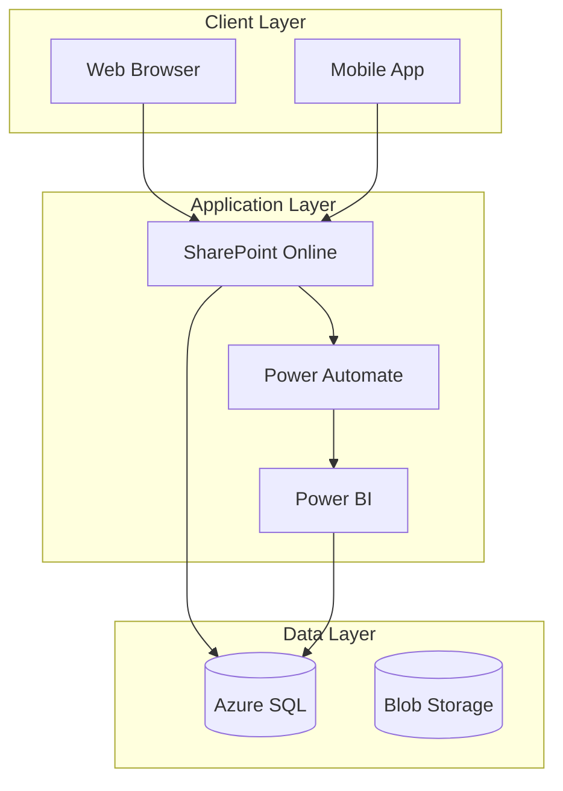
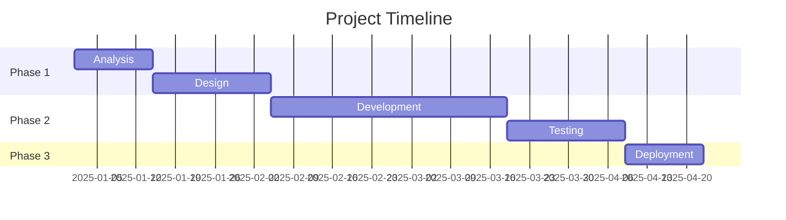
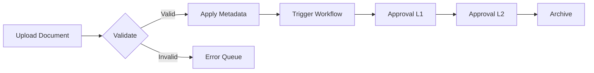
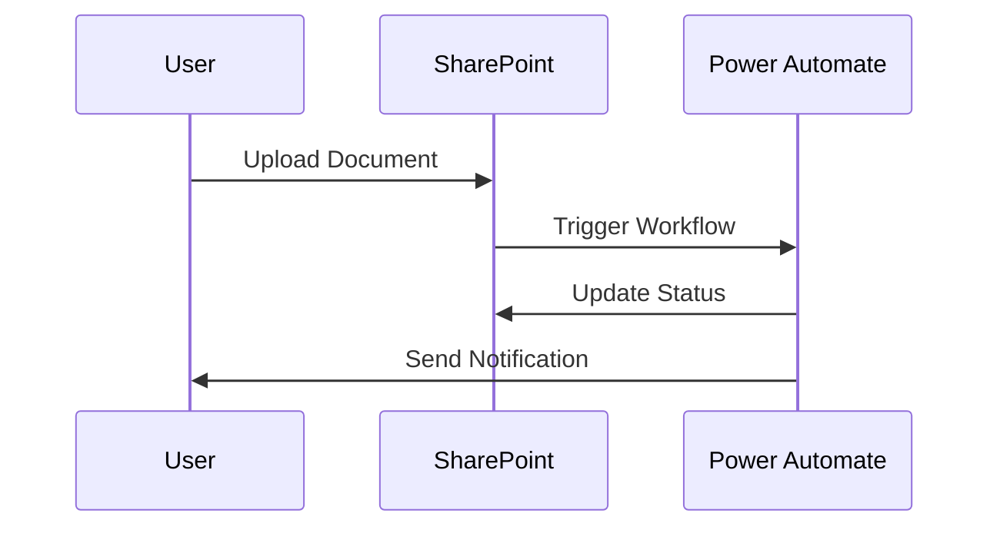

# 🚀 COMPLETE INTERACTIVE PROPOSAL GENERATOR - CLAUDE CLI PROMPT

## PROJECT OVERVIEW

Build an AI-powered proposal generator that:
1. **Uploads a template** (like Linkfields/Tiger Brands) and extracts its structure
2. **Interactive Q&A** gathers requirements through conversation
3. **Generates proposals** with dynamic content, charts, graphs, diagrams
4. **Same design** - matches the exact template styling
5. **Fully editable** - logos, colors, text all replaceable

---

## MASTER PROMPT FOR CLAUDE CLI

Copy this entire prompt into Claude CLI:

```
You are building a Complete Interactive Proposal Generation System. This system:

1. Accepts uploaded DOCX templates and extracts their structure
2. Uses interactive Q&A to gather proposal requirements
3. Generates proposals matching the exact template design
4. Includes charts (Chart.js), graphs, and diagrams (Mermaid)
5. Supports dynamic placeholder replacement
6. Makes logos, colors, and all content easily editable

## TECH STACK

### Backend
- Node.js 20+ with TypeScript
- Express.js API
- PostgreSQL 16 + pgvector for RAG
- Drizzle ORM

### Frontend
- React 18 + TypeScript
- Tailwind CSS + shadcn/ui
- Chart.js for charts/graphs
- Mermaid.js for diagrams
- TipTap for rich text editing

### AI Models
- Claude (Anthropic) - Primary content generation
- OpenAI - Embeddings for RAG
- Grok (xAI) - Diagram generation

### Document Generation
- docx library - Word document creation
- pdfkit - PDF generation
- sharp - Image processing

---

## CORE FEATURES TO BUILD

### FEATURE 1: Template Upload & Analysis

When user uploads a DOCX template:

1. **Extract with pandoc**: Convert to Markdown for text structure
2. **Unzip DOCX**: Access raw XML, styles, images
3. **Extract images**: Logos, cover images, charts
4. **Analyze styling**: Colors, fonts, table styles from styles.xml
5. **Generate schema**: JSON template definition

```typescript
interface TemplateSchema {
  template_name: string;
  branding: {
    primary_color: string;    // e.g., "#F7941D"
    secondary_color: string;  // e.g., "#0066B3"
    heading_font: string;
    body_font: string;
  };
  assets: {
    cover_image?: string;     // Base64 or path
    company_logo?: string;
    client_logo?: string;
  };
  sections: Array<{
    order: number;
    id: string;
    title: string;
    content_type: "paragraphs" | "bullets" | "table" | "chart" | "diagram";
    supports_chart?: boolean;
    supports_diagram?: boolean;
  }>;
  table_styles: {
    header_bg_color: string;
    header_text_color: string;
    alternating_rows: boolean;
  };
  chart_styles: {
    colors: string[];
  };
}
```

### FEATURE 2: Interactive Q&A System

Create a conversational interface that gathers:

**Phase 1: Client Info**
- Company name, contact person, industry

**Phase 2: Project Details**
- Title, type, description, objectives

**Phase 3: Scope**
- In-scope items, out-of-scope, deliverables

**Phase 4: Timeline**
- Duration, milestones, start date

**Phase 5: Budget**
- Amount, currency, payment structure

**Phase 6: Visualization Preferences**
- Include diagrams? (architecture, flow, gantt)
- Include charts? (bar, pie, line)
- Style preference (minimal, detailed, infographic)

**Q&A Rules:**
- Ask ONE question at a time
- Acknowledge answers before moving on
- Handle "I don't know" with smart defaults
- Summarize periodically
- Confirm before generating

### FEATURE 3: Dynamic Placeholder System

Support these placeholders throughout all content:

```typescript
interface DynamicPlaceholders {
  // Company
  "{{company_name}}": string;
  "{{company_logo}}": string;
  "{{company_website}}": string;
  
  // Client
  "{{client_name}}": string;
  "{{client_company}}": string;
  "{{client_logo}}": string;
  
  // Project
  "{{project_title}}": string;
  "{{project_subtitle}}": string;
  
  // Dates
  "{{date}}": string;
  "{{start_date}}": string;
  "{{timeline}}": string;
  
  // Financial
  "{{currency}}": string;
  "{{total_amount}}": string;
  
  // Version
  "{{version}}": string;
}
```

### FEATURE 4: Chart Generation (Chart.js)

Generate these chart types:

**Bar Chart** - Cost breakdown by phase:
```json
{
  "type": "bar",
  "title": "Project Cost by Phase",
  "data": {
    "labels": ["Analysis", "Design", "Development", "Testing", "Deployment"],
    "datasets": [{
      "label": "Cost (R)",
      "data": [150000, 200000, 450000, 180000, 120000],
      "backgroundColor": ["#F7941D", "#0066B3", "#F7941D", "#0066B3", "#F7941D"]
    }]
  }
}
```

**Pie Chart** - Payment schedule:
```json
{
  "type": "pie",
  "title": "Payment Distribution",
  "data": {
    "labels": ["Discovery 30%", "Development 40%", "Testing 20%", "Deployment 10%"],
    "datasets": [{
      "data": [30, 40, 20, 10],
      "backgroundColor": ["#F7941D", "#0066B3", "#FFB347", "#4A90D9"]
    }]
  }
}
```

**Line Chart** - Progress tracking:
```json
{
  "type": "line",
  "title": "Project Progress",
  "data": {
    "labels": ["Week 1", "Week 2", "Week 3", "Week 4"],
    "datasets": [
      {"label": "Planned", "data": [10, 30, 60, 100], "borderColor": "#0066B3"},
      {"label": "Actual", "data": [8, 25, 55, 90], "borderColor": "#F7941D"}
    ]
  }
}
```

**Radar Chart** - Risk assessment:
```json
{
  "type": "radar",
  "title": "Risk Assessment",
  "data": {
    "labels": ["Technical", "Resource", "Timeline", "Budget", "Scope"],
    "datasets": [{
      "label": "Risk Level",
      "data": [70, 50, 60, 40, 55],
      "backgroundColor": "rgba(247, 148, 29, 0.2)",
      "borderColor": "#F7941D"
    }]
  }
}
```

### FEATURE 5: Diagram Generation (Mermaid)

**Architecture Diagram**:


**Gantt Chart**:


**Flow Diagram**:


**Sequence Diagram**:


### FEATURE 6: User Interaction for Visualization Changes

Allow users to:
1. **Switch visualization types**: Table ↔ Chart ↔ Diagram
2. **Edit chart data**: Modify values, labels, colors
3. **Change diagram type**: Architecture ↔ Flow ↔ Sequence
4. **Toggle visualizations**: Show/hide individual charts/diagrams
5. **Customize colors**: Match their brand

```typescript
interface VisualizationPreferences {
  section: string;
  preferredType: "table" | "chart" | "diagram" | "none";
  chartType?: "bar" | "pie" | "line" | "radar";
  diagramType?: "architecture" | "flow" | "gantt" | "sequence";
  showVisualization: boolean;
  customColors?: string[];
}
```

### FEATURE 7: Logo & Asset Management

```typescript
interface AssetManager {
  // Upload and store logos
  uploadLogo(file: File, type: "company" | "client"): Promise<string>;
  
  // Get logo for use in document
  getLogo(type: "company" | "client"): string | null;
  
  // Update logo
  replaceLogo(type: "company" | "client", file: File): Promise<void>;
  
  // Delete logo
  deleteLogo(type: "company" | "client"): Promise<void>;
  
  // List all assets
  listAssets(): Asset[];
}
```

---

## DATABASE SCHEMA

```sql
-- Templates table
CREATE TABLE templates (
  id UUID PRIMARY KEY DEFAULT gen_random_uuid(),
  name TEXT NOT NULL,
  slug TEXT UNIQUE NOT NULL,
  schema JSONB NOT NULL,
  assets JSONB,
  is_active BOOLEAN DEFAULT true,
  created_at TIMESTAMP DEFAULT NOW()
);

-- Proposals table
CREATE TABLE proposals (
  id UUID PRIMARY KEY DEFAULT gen_random_uuid(),
  template_id UUID REFERENCES templates(id),
  client_name TEXT NOT NULL,
  client_company TEXT NOT NULL,
  project_title TEXT NOT NULL,
  project_type TEXT,
  scope TEXT,
  objectives TEXT,
  budget TEXT,
  timeline TEXT,
  technologies JSONB,
  generated_content JSONB,
  visualizations JSONB,
  placeholders JSONB,
  status TEXT DEFAULT 'draft',
  created_at TIMESTAMP DEFAULT NOW()
);

-- Conversations table (for Q&A)
CREATE TABLE conversations (
  id UUID PRIMARY KEY DEFAULT gen_random_uuid(),
  proposal_id UUID REFERENCES proposals(id),
  messages JSONB NOT NULL,
  extracted_data JSONB,
  current_phase TEXT,
  is_complete BOOLEAN DEFAULT false,
  created_at TIMESTAMP DEFAULT NOW()
);

-- Assets table (logos, images)
CREATE TABLE assets (
  id UUID PRIMARY KEY DEFAULT gen_random_uuid(),
  proposal_id UUID REFERENCES proposals(id),
  type TEXT NOT NULL, -- 'company_logo', 'client_logo', 'cover_image'
  filename TEXT NOT NULL,
  data BYTEA NOT NULL,
  mime_type TEXT NOT NULL,
  created_at TIMESTAMP DEFAULT NOW()
);

-- RAG chunks with vector embeddings
CREATE TABLE document_chunks (
  id UUID PRIMARY KEY DEFAULT gen_random_uuid(),
  proposal_id UUID REFERENCES proposals(id),
  section_type TEXT NOT NULL,
  content TEXT NOT NULL,
  embedding vector(1536),
  created_at TIMESTAMP DEFAULT NOW()
);

-- Create vector index
CREATE INDEX ON document_chunks USING ivfflat (embedding vector_cosine_ops);
```

---

## API ROUTES

```typescript
// Template routes
POST   /api/templates/upload          // Upload and analyze template DOCX
GET    /api/templates                  // List all templates
GET    /api/templates/:slug            // Get template schema
PUT    /api/templates/:slug            // Update template
DELETE /api/templates/:slug            // Delete template

// Proposal routes
POST   /api/proposals                  // Create new proposal
GET    /api/proposals                  // List proposals
GET    /api/proposals/:id              // Get proposal
PUT    /api/proposals/:id              // Update proposal
DELETE /api/proposals/:id              // Delete proposal

// Q&A routes
POST   /api/proposals/:id/conversation/start   // Start Q&A
POST   /api/conversations/:id/chat             // Send message
GET    /api/conversations/:id                  // Get conversation state

// Generation routes
POST   /api/proposals/:id/generate             // Generate content
POST   /api/proposals/:id/regenerate/:section  // Regenerate section

// Visualization routes
GET    /api/proposals/:id/visualizations       // Get all visualizations
PUT    /api/proposals/:id/visualizations/:type // Update visualization
POST   /api/proposals/:id/visualizations/add   // Add visualization

// Asset routes
POST   /api/proposals/:id/assets               // Upload asset
GET    /api/proposals/:id/assets               // List assets
PUT    /api/proposals/:id/assets/:assetId      // Replace asset
DELETE /api/proposals/:id/assets/:assetId      // Delete asset

// Export routes
POST   /api/proposals/:id/export/docx          // Export to Word
POST   /api/proposals/:id/export/pdf           // Export to PDF
POST   /api/proposals/:id/preview              // Generate preview
```

---

## FRONTEND COMPONENTS

### 1. TemplateUploader
- Drag-and-drop DOCX upload
- Shows extraction progress
- Displays extracted schema
- Allows editing of colors/fonts

### 2. ConversationChat
- Chat interface for Q&A
- Shows progress indicator
- Displays extracted data sidebar
- Has "Start Generation" button when complete

### 3. ProposalEditor
- Section-by-section editing
- Rich text with TipTap
- Inline chart/diagram editing
- Placeholder highlighting

### 4. VisualizationPanel
- Chart type selector
- Diagram type selector
- Data editor
- Color picker
- Preview panel

### 5. AssetManager
- Logo upload/replace
- Image preview
- Drag-and-drop support
- Crop/resize tools

### 6. PreviewPanel
- Real-time preview
- Page navigation
- Zoom controls
- Print preview

### 7. ExportDialog
- Format selection (DOCX/PDF)
- Quality options
- Placeholder replacement preview
- Download button

---

## BRANDING (Linkfields Template)

```typescript
const LINKFIELDS_BRANDING = {
  colors: {
    primary: "#F7941D",      // Orange
    secondary: "#0066B3",    // Blue
    accent: "#FFB347",       // Light Orange
    heading: "#0066B3",      // Blue
    body: "#333333",         // Dark Gray
    background: "#FFFFFF",   // White
    altRow: "#F5F5F5",       // Light Gray
    tableHeader: "#F7941D",  // Orange
    tableHeaderText: "#FFFFFF" // White
  },
  fonts: {
    heading: "Arial",
    body: "Arial"
  },
  sizes: {
    heading1: 18,
    heading2: 14,
    heading3: 12,
    body: 11
  }
};
```

---

## IMPLEMENTATION PHASES

### Phase 1: Core Setup
- Project structure
- Database schema
- Basic API routes

### Phase 2: Template System
- DOCX upload and extraction
- Schema generation
- Asset extraction

### Phase 3: Q&A System
- Conversation service
- AI integration
- Data extraction

### Phase 4: Content Generation
- AI content generation
- RAG integration
- Placeholder system

### Phase 5: Visualizations
- Chart.js integration
- Mermaid.js integration
- User customization

### Phase 6: Document Export
- DOCX generation
- PDF generation
- Asset embedding

### Phase 7: Frontend
- React components
- Real-time preview
- Editing interface

---

## START BUILDING

Begin with Phase 1: Create the project structure, database schema, and basic API.

Ask me for any clarification as you build each component.
```

---

## QUICK START COMMANDS

```bash
# Start Claude CLI
claude

# Paste the master prompt above

# Then give these commands phase by phase:

# Phase 1
"Create the project structure and database schema with PostgreSQL + pgvector"

# Phase 2
"Build the template upload system that extracts structure from DOCX files"

# Phase 3
"Create the interactive Q&A conversation system"

# Phase 4
"Build the AI content generation with RAG support"

# Phase 5
"Add Chart.js and Mermaid.js visualization generation"

# Phase 6
"Create the DOCX export with all styling and embedded visualizations"

# Phase 7
"Build the React frontend with all components"
```

---

## KEY FILES TO CREATE

```
proposal-generator/
├── apps/
│   ├── api/
│   │   └── src/
│   │       ├── db/
│   │       │   └── schema.ts              # Database schema
│   │       ├── services/
│   │       │   ├── template-analyzer.ts   # DOCX extraction
│   │       │   ├── conversation.ts        # Q&A service
│   │       │   ├── content-generator.ts   # AI generation
│   │       │   ├── visualization.ts       # Charts & diagrams
│   │       │   ├── docx-generator.ts      # Word export
│   │       │   ├── asset-manager.ts       # Logo management
│   │       │   └── rag.ts                 # RAG service
│   │       └── routes/
│   │           └── index.ts               # API routes
│   └── web/
│       └── src/
│           └── components/
│               ├── TemplateUploader.tsx
│               ├── ConversationChat.tsx
│               ├── ProposalEditor.tsx
│               ├── VisualizationPanel.tsx
│               ├── AssetManager.tsx
│               ├── PreviewPanel.tsx
│               └── ExportDialog.tsx
├── packages/
│   └── shared/
│       └── src/
│           └── types.ts                   # Shared types
└── docker-compose.yml
```

---

## SAMPLE WORKFLOW

1. **User uploads Linkfields template** → System extracts schema, logos, styling
2. **User starts Q&A** → "Hi! What company is this proposal for?"
3. **User answers questions** → System gathers all requirements
4. **User confirms** → System generates content with visualizations
5. **User reviews** → Can edit text, change charts, swap diagrams
6. **User customizes** → Upload own logos, adjust colors
7. **User exports** → Download professional DOCX with everything embedded
